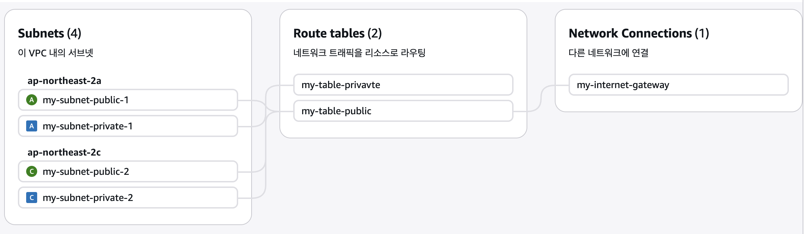

## 📆 2025-11-10

### 🔔 스크럼

- AWS(네트워크/접근제어, 스토리지) 강의 복습 및 정리

### 🚀 Today I Learned

#### 왜 클라우드를 쓸까?

- 서버 비쌈
- 따라서 서버 임대하고싶다
  - 물리적 서버 임대 방식이 있었지만 확장 어려움
- 그럼 가상화해서 서버 팔까?
  - 물리적인 작업을 가상으로해서 나눠주자
  - 최초가 AWS!
- 서버를 사서 썼을때
  - 초기 비용 > 이후비용 안듬
  - 물리 서버 임대 > 구독료가 좀 있음
  - 클라우드 > 물리서버 + 임대서버+가상화 + 편리함 = 비용을 내고, 편리함을 얻음
- 만약 필요한 서버 3천대면 클라우드 비용내는대신 초기비용이 드는게 나을수도?

#### VPC(Virtual Private Cloud)

- 클라우드 안에서 자신만의 네트워크 구조를 논리적으로 생성하거나 나눈다거나 관리할 수 있도록 하는 서비스
- 내부전용의 프라이빗 서브넷, 외부접속이 허용되는 퍼블릭 서브넷 구축가능하고, 라우팅 테이블, 보안 그룹 등을 세밀하게 제어할 수 있음
- VPC 주요 구성요소
  - 퍼블릭 서브넷 : 인터넷에서 바로 접근 가능한 서브넷
    - 정적파일 서빙
    - 인터넷 게이트웨이를 통해 인터넷과 연결됨
  - 프라이빗 서브넷 : 인터넷에서 바로 접근X, 내부 통신만 가능한 서브넷
    - WAS, DB, SS(Session Store)
    - NAT 게이트웨이 or VPN을 통해 외부와 간접적으로 연결됨
  - 라우팅 테이블 : 서브넷 간 또는 인터넷과의 데이터 흐름을 결정하는 라우팅 규칙 목록
  - 인터넷 게이트웨이 : VPC와 인터넷간의 연결을 지원하는 게이트웨이 장치
  - NAT 게이트웨이 : 프라이빗 서브넷에서 인터넷으로의 아웃바운드 연결을 지원하는 장치
  - 보안 그룹 : 인스턴스 수준에서 트래픽을 제어하는 상태 저장형 방화벽
  - 네트워크 ACL : 서브넷 전체의 트래픽을 제어하는 상태 비저장형 접근제어 규칙 집합
- 사용 이유 : 클라우드에서 네트워크를 논리적으로 격리,제어해 보안성과 확장성을 동시에 확보하기 위함
- 보통 네트워크 구성할때
  - AWS안에서 VPC안을 이렇게 나눔
    - 퍼블릭 : Web Server
    - 프라이빗 : WAS,DB
    - 얘네둘이 통신을 위해 라우팅 테이블
    - VPC안에 들어올때 라우팅
  - 리전마다 VPC를 기본적으로 하나씩 만들어줌
- VPC 생성 → 서브넷 생성 → 인터넷 게이트웨이(IGW) 생성 → 라우팅 테이블 생성 → 라우팅 테이블-IGW연결
  - 기본 라우팅 테이블 외에 외부 인터넷과 통신을 하기 위한 public용 라우팅 테이블을 생성하는 것
    

#### IAM

- AWS 리소스에 대한 사용자 인증과 권한관리를 제공하는 서비스
- 사용 이유 : 사용자와 리소스에 대한 세밀한 제어 → 보안성 강화&안전 운영
- 클라우드 네이티브
  - 비용 최적화
  - 안정성
  - 보안
    - 내 회사에 있는 사람들이 접근할 수 있는 서비스를 최대한 작게하는것

#### 보안그룹

- 해당 클라우드의 인스턴스에서 들어오고(인바운드) 나가는(아웃바운드) 트래픽을 제어하는 가상 방화벽
  - 인스턴스 = 노드 → NIC가 하나씩 붙어있음
- 인바운드 : 보통 보안그룹에서는 이걸 더 중요시함
  - 기본적으로 인바운드 트래픽은 차단됨 → WHY? 보안강화를 위해
- 아웃바운드

#### Route 53

- = DNS Service
- AWS에서 제공하는 확장 가능한 DNS서버 + 트래픽 라우팅 + etc
- 지리적 위치 기반 트래픽 라우팅 : 사용자의 접속 지역에 따라 가장 적합한 서버로 요청을 보내는 기능

#### EC2(Elastic Compute Cloud)

- 사용자가 필요에 따라 쉽게 가상 서버(인스턴스)를 생성, 구성, 관리할 수 있도록 하여 다양한 워크로드를 지원하는 확장 가능하고 안전한 클라우드 컴퓨팅 서비스
  - 워크로드 : 시스템이 처리해야하는 작업의 양이나 유형
- Elastic : 유연성, 확장성을 나타내는 용어
  - 자동 확장, 유연한 리소스 사용, 신속한 배포
- 끄고 킬때마다 퍼블릭 IP가 바뀜 → 고정하려면 EIP 사용함

#### ACM(AWS Certificate Manager)

- AWS에서 SSL/TLS 인증서를 쉽게 관리하고 배포할 수 있게 해주는 서비스
- 최상위 인증기관에서 처리량이 많아지면 보안성이 떨어지니까 중간 인증기관을 둔건데, 그중 하나가 AWS
- 안써도 되는데, 그럼 발급해서 설치를 알아서 해야함. AWS에서하면 쉽게 발급~설치까지 가능!

#### 탄력적인 IP (Elastic IP)

- 동적 클라우드 환경에서 고정된 퍼블릭 IP주소를 유지할 수 있도록 고안된 AWS 서비스
- 사용하면 돈을 냄
  - 왜? ISP(인터넷 서비스 사업자)가 IP도 팔음 → 공개, 고정된 주소
- 그래서 퍼블릭IP는 하나만하고 서브넷팅해서 프라이빗 IP를 만들어서 그 내부에서 사용함

#### EFS

- AWS에서 제공하는 확장 가능하고 관리되는 네트워크 파일 시스템
- 여러개의 인스턴스들이 공용으로 두어 접근/공유할 수 있는 파일시스템
- NFS(Network File System) 프로토콜을 사용해, EC2 인스턴스나 다른 서버에서 EFS 파일 시스템을 마운트함으로써 로컬 디스크처럼 사용할 수 있음
  - NFS : 네트워크상에서 파일을 공유하고 액세스할 수 있게 해주는 표준 프로토콜
- 실무 예시
  - 100개의 EC2가 동일한 파일에 접근해야할때
    - EC2 100개가 동일한 웹 애플리케이션 서빙 해야할때 - jar, node.js
    - 각각 접근하기보다 EFS 사용
    - 빌드한 파일, 공용 이미지, 세션 데이터 공유할 때, 모든 인스턴스 접근
  - EC2 + AI 모델
    - 각 EC2에 AI를 붙이는게 아니라 EFS에 둬서 마운트 할 수 있게
  - 람다 ← 서버리스 코드 실행
  - 미디어 처리, 데이터 분석
  - CI/CD 빌드, 직접 서버에서 해야할때
- 사용이유 : 동시 액세스 및 데이터 공유, 고가용성 및 내구성 보장
- 읽기/쓰기 가능 → 한명이 쓰고있으면 락걸어놓고 못쓰게함
- 다른 기술과의 비교
  - EFS vs S3 = 파일 스토리지 vs 객체 스토리지
- Q : 너무 많이 접근하면 느려지는거 아닐까?
- A : 맞음, 느려질 수 있음. I/O 크기 최적화 또는 권장 마운트 옵션 사용 등으로 성능을 최적화하여 사용하면됨
- ⇒ EFS는 공유 파일 시스템이라는 장점이 있지만 성능 특성을 이해하고 올바르게 구성해야 예상치 못한 성능 저하를 방지할 수 있다.

#### S3

- 대규모 데이터를 안전하게 저장하고 검색할 수 있는 확장 가능한 객체 스토리지 서비스
- 웹서비스 인터페이스를 통해 쉽게 올릴 수 있고, 높은 내구성과 가용성 제공
  - 웹 인터페이스로 접근이 가능하다? = 인터넷에 링크로 업로드,다운로드가 가능하다
  - 가용성 : 아마존이 다운되더라도, s3는 돌아감(설정에 따라 다름)
  - 내구성 : 데이터의 유실가능성이 적은것
- 정적 웹사이트 호스팅도 가능 - 프론트엔드 정적파일들 버킷에 올려놓고, 라우트53에 어느포트로 들어오느냐에따라 s3로 보낼지 어디로 보낼지 나눌수도 있음
- 비용
  - 보관 비용
  - **네트워크 비용** : 올린 사진들을 링크로 다운로드 받을 수 있으니까. 그렇게 하기위한 비용임 → 비쌈
  - CDN : 네트워크 비용이 비싼걸 완화하기 위해. 클라이언트 ↔ CDN ↔ S3
  - 압축도 많이함 : 네트워크 비용이 비싼걸 완화하기 위해
  - S3 라이프사이클 : 보관비용도 줄이고 싶을때 사용.
    - default없고, 다 설정해줘야하는것. 몇개월동안 이런 정책 설정도 직접 해야함
    - HOT
      - 먼저 핫스토리지에 업로드
      - 자주 접근되는 애들, 최근에 업로드한 애들
      - 그래서 비쌈 → 자주 접근 & 더 빠른 스토리지
    - COLD
      - 3개월동안 접근안하면 콜드 스토리지로 옮김
      - 자주 접근 X → 덜빠르고, 더 크게 저장할 수 있음
    - Glacier
      - 거의 접근 안하는 애들
      - 되게 느린 스토리지. 디스크에다가 옮기기도함
- 링크로 접근 가능하다보니 취약점
  - 버킷명이 다 들어나다 보니, route53에서 안보이게 할수도있음
  - CDN서비스를 사용하여 실제 S3 URL을 사용자에게 직접 노출시키지X

### 🗨️ 오늘의 회고

- 지난주에 했던 과제 내용들을 이론으로 배우니 애매했던 개념들이 잡힌것 같다.
