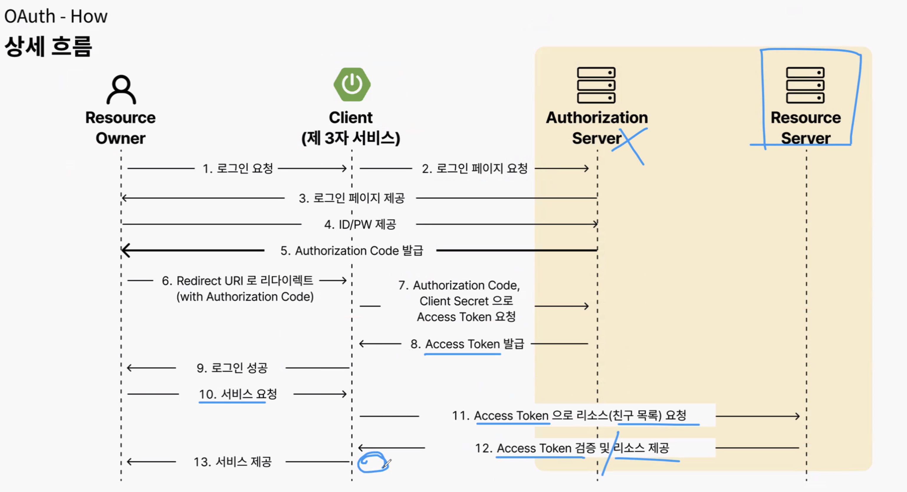

## 📆 2025-10-30

### 🔔 스크럼

- OAuth 강의 복습 및 정리
- 7주차 과제 2번(JWT로 마이그레이션) 완료하기
  - access, refresh 토큰 만료일 다시 고민해보기
  - jwt로 바꾸고 나서 모든 js, API 잘 돌아가는지 확인
  - jwt관련 코드 리팩토링
  - 헤더 구현

### 🚀 Today I Learned

#### OAuth

- 인증은 유저가 직접하고 인가는 우리 어플리케이션이 받는다!
- 생긴 이유 : ex) 커뮤니티에서 카카오 로그인을 OAuth없이 이용한다! → 인증과 인가에 둘다 커뮤니티가 관여하고있어서 힘듬 & 누구에게 보안책임? ⇒ 분리하자
  - 인증 : “사용자 → 카카오톡” 바로 인증
  - 인가 : 인증된 정보를 우리 서비스에 넘겨주면 카카오톡에 권한,인증 정보를 줘서 카카오톡에서 정보 받고 처리해서 유저한테 주면됨
- 사용 이유 : 인증과 인가를 분리함으로 외부 서비스에 정도를 제공하기 위해
- 상세 흐름
  
  - 6번까지가 인증완료
  - 7 번: 유저한테 받은 임시키(authorization code)랑 시크릿키를 주고 맞으면 access토큰 발급해줘!
    - 클라이언트 시크릿키는 Authorization Server는 유일한 값으로 등록되어있음 ex) 커뮤니티 서비스의 secret key는 이거야!
  - 8번의 엑세스 토큰은 제3자 서비스가 보관
  - Access Token : 토큰자체에 정보를 들고있지 않고, 토큰을 가지고 요청했을때 아래 정보들 줌
    - 이메일, 이름 등(로그인할때 카카오한테 넘겨주겠다고 한 정보들) + 엑세스 토큰 키값
    - jwt 토큰 아님. 카카오가 주는 액세스 토큰임
    - 여기에 있는 정보들을 DB에 저장하면 회원가입임 → OAuth만 사용하는 서비스들은 회원가입이 없음. 로그인만 존재
  - 우리 서버 인증용 JWT 발행
    - jwt가 아닐수도 있고, 어떻게 개발할거냐에 따라 다름
    - 클라이언트가 리소스 오너한테 전달한 response 객체
      1. 클라이언트 기반 JWT인증(body)
      2. 인증서버 기반 엑세스 토큰(body)
      3. 인증서버 기반 리프레시 토큰(Cookie)
  - Authorizaton발급을 바로 클라이언트한테 안주고 오너한테 줬다가 왜 리다이렉트함?
    - HTTP stateless + 보안성 때문
    - 4번할때오너가 Authorizatoin Server가 받음 → 서버 입장에서는 오너랑 클라이언트 구분 못함 → 그냥 왔던애한테 다시 주는거
    - 또한 오너한테 갔다가 다시 클라이언트한테 가야하기 때문에 탈취의 우려가 있어 임시키 발급한거임
  - 서버가 없다면?
    - PKCE방법 있음 → 권장X, 보통은 서버가 있는게 나음
      - 웹앱에서 직접 엑세스 토큰 교환
      - 로그인마다 임시 비번만들어 사용하는 방식임

### 🔥 오늘의 도전 과제와 해결 방법

- access, refresh 토큰 만료일 결정 : 현재 내 커뮤니티는 폐쇄형 커뮤니티고, 중요한 정보들이 왔다갔다 한다는걸 사용자들이 알게된다면, 일정 기간 이후 로그인을 해야한다는걸 당연하게 받아들이지 않을까 하는 생각에 그렇게 결정했다. 그렇다고 정부기관이나 은행처럼 심각한?보안정도는 아니니 7일정도로 두면 적당할 듯 싶어서 refresh token의 만료기간을 7일로둠

- 헤더 구현 : 로그인여부를 따져서 헤더 프로필이 나와야하는데, 페이지 랜더링 해줄때 쿠키에 담긴 토큰의 유무를 따져서 전역변수로 선언했다.

### 🗨️ 오늘의 회고

- 토큰 만료일을 결정할때, 순수한 나의 고민만으로 결정해야하는것인지? 외부 자료들을 찾아보고 결정해야하는 것인지? 또 나의 결정이 옳은것인지? 무엇이 정답인지에 대해 고민해봤다. 내가 정한 결론은 "정답은 없다! 그렇게 설정한 이유만 있으면 된다!"이다. 나의 고민과 외부 자료들을 참고하여 나의 폐쇄형 커뮤니티 서비스에는 이게 맞을거라는 생각을 가지고 결정했다. 하나하나 결정하는 것도 고민이다.
- 헤더 구현을 전역변수로 하고나서 생각해보니, 로그인없이 들어갈 수 있는 페이지가 로그인, 회원가입 페이지밖에 없는데 url로 처리할걸 그랬나? 하는 생각이 들었지만, url보다는 확실한 값으로 체크하는게 나을거 같아서 그대로 진행했다.
